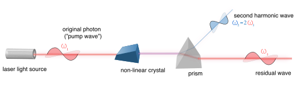

# RTEA-Real Time Evaluation of Asteroid

We have used machine learning technique(Deep Neural Network) to classify near earth objects whether they are hazardous to earth or not and predict impact if any asteroid hit the earth.
NEO that can hit earth are visualised in 3d in our web app.
Project includes the following features - 
 - Hazardous asteroid nformation from NASA directory(using API) in real time.
 - Close approach date and time.
 - Asteroid orbit visualisation in 3d
 - Asteroid impact information

Api used here are 
- https://api.nasa.gov/neo/rest/v1/feed?start_date=2015-09-07&end_date=2015-09-08&api_key=3vgYWNjKFyD7st8laqSmoZBka5uHuluQcYXusMtr
- https://api.nasa.gov/neo/rest/v1/neo/3542519?api_key=3vgYWNjKFyD7st8laqSmoZBka5uHuluQcYXusMtr

# Prediction of Threat
Machine Learning is a technique which can be used to predict whether a Near Earth
Object poses a threat to planet Earth or not by analysing its mundane features such as
reflectivity ,rotation and composition and then comparing these features to those of the
NEOs which entered the Earth’s atmosphere.
The training set or the previous data set of asteroid detection can be the following: 

| Composition(x1)  | Reflectivity (x2)  | Rotation (x3)     | Minimum distance of the asteroids trajectory from Earth (y)|
| ---------------- | ------------------ |-------------------|------------------------------------------------------------|
| Data from NEOWISE| Data from NEOWISE  | Data from NEOWISE |    Data from NEOWISE                                       |

Using a mean normalisation method, we scale the values of x1, x2 and x3 so that they lie
between -1<=xi<=1 and it is easy for the other machine learning algorithms to work
their way around the data : 

                  x_i=(x_i-µ_i)/Range
Our next step is to just define a hypothesis function, h :

                  h_⁡θ(x) = x_0 θ_0+ θ_1x_1+ θ_2x_2
The hypothesis can either be polynomial or linear depending on the kind of data collected.

Our next step is to choose the best values of θ0, θ1 and θ2 such that the hypothesis, h
can pass through the maximum number of points and thus produce a graph that
accurately predicts data.
The way to do this is by defining a cost function J(θ0,θ1,θ2) and trying to obtain the
minimum value for it ,since, cost function is nothing but 1/2m * (The sum of the square
distance of a test point from the linear/polynomial regression line)
The cost function is defined as follows: 

                  J(θ) = 1/2m (Σ (hϴ(x(i) - y(i))2) 

where, 
 θ→ The vector of θi defined above 
 m→ The number of training examples
 
Now, using random values of θi, we obtain values of J(θ) and plot a contour graph
between J(θ) and θ1 and θ2.

To find the minimum value J(θ), we employ a
gradient descent algorithm which looks like this: 
Repeat { 
                 θj := θj - α (ϑ/ϑθj)J(θ)
} 
OR 
Repeat { 
                 θj := θj - α (1/m)(hθ(x(i))-y(i))(xj(i)) 
} 

This statement is further equivalent to:

Repeat { 
                 θ0 := θ0 - α (1/m)(hθ(x(i))-y(i))(x0(i)) 
                 θ1 := θ1 - α (1/m)(hθ(x(i))-y(i))(x1(i)) 
                 θ2 := θ2 - α (1/m)(hθ(x(i))-y(i))(x2(i)) 
} 

where, 
α→learning rate 
The gradient descent algorithm will start with random values of θ[] and keep changing
θ[] to reduce J(θ) until we end up at a minimum.  
The values of θ[] corresponding to the minimum value of J(θ) can be put back into the 
hypothesis function which can now be successfully used to predict whether an asteroid 
will come near the earth or not depending on its values of rotation, reflectivity and
composition.  

# Asteroid Deflection Mechanisms 
We propose to build a small space station that will be the storage site for the
Photons aggregated from the sun.

Inside the space station we will have collider that works on the principle of
Second Harmonic generation (SHG)( In the process non-linear material are
effectively "combined" to generate new photons with twice the energy, and
therefore twice the frequency and half the wavelength of the initial photons.)

The collider will basically keep on combining 2 photons to develop the 3rd
photon with a different angular frequency and then combine the newly
generated photons too, continuing this process to store up Photons of huge
energy and also conserving their momentum until an asteroid is detected to be
deflected.

Once the asteroid is detected The space station will use the stored Photons.The
asteroids course will then be changed by a beam of highly dense anisotropic
emission of thermal Photons that will deflect the asteroid by the phenomenon of
the Yarkovsky effect.  

